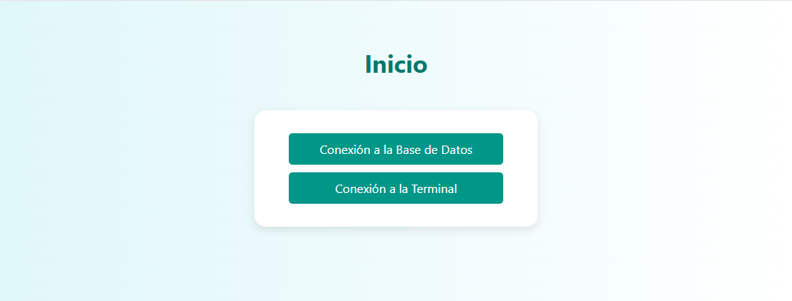
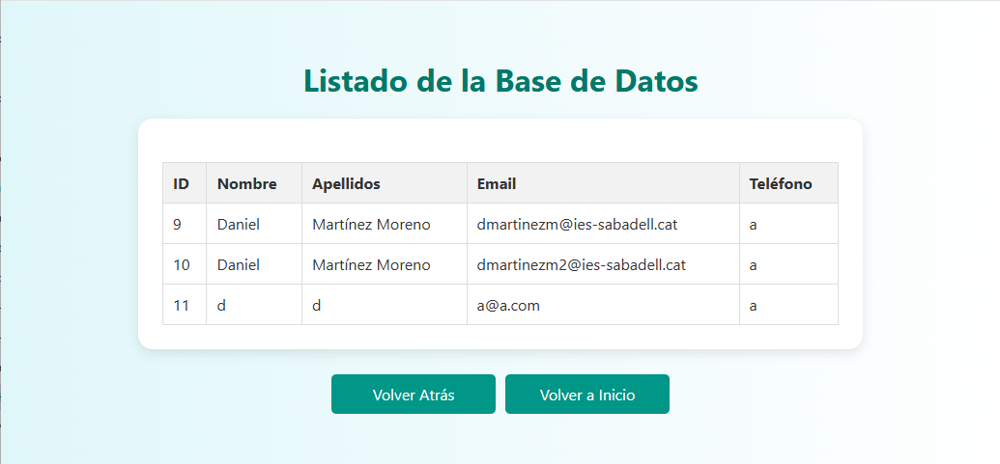
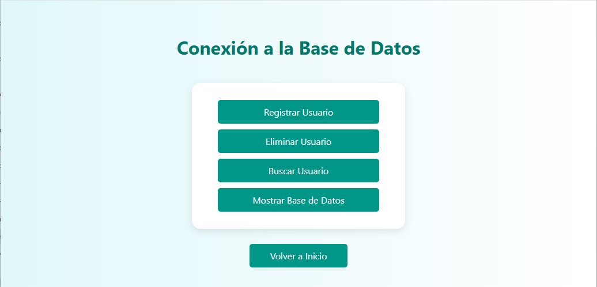
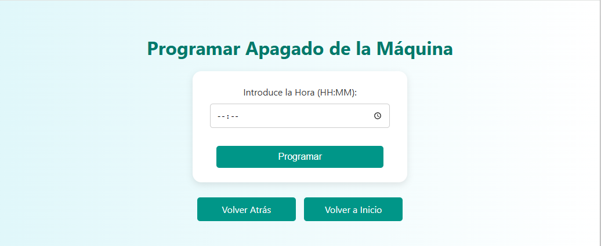

# 📁 M04 - PHP

Este proyecto es una práctica del módulo **M04** (Lenguajes de marcas y sistemas de gestión de información), que consiste en un sitio web desarrollado en **HTML**, **CSS** y **PHP**, desplegado en un servidor **Apache**. El sitio ejecuta comandos del sistema con `shell_exec` y se conecta a una base de datos para mostrar o gestionar información.

Puedes ver la web en [mi página web](http://espetoneta.es) (NO DISPONIBLE AÚN)
---

## 🚀 Funcionalidades del Sitio Web

- Página de inicio con diseño en HTML y CSS.
- Scripts PHP que:
  - Ejecutan comandos del sistema operativo mediante `shell_exec`.
  - Se conectan a una base de datos (MariaDB/MySQL).
- Interfaz sencilla para la visualización de datos y ejecución de operaciones.
- Muestra del estado del sistema o resultados de comandos.

---

## 📁 Estructura del Proyecto

El proyecto contiene los siguientes archivos y carpetas:

### Archivos HTML

- `index.html`: Página principal del sitio web con enlaces a distintas funcionalidades.
- `add.html`: Formulario para añadir nuevos datos a la base de datos (vincula con `add.php`).
- `delete.html`: Interfaz para eliminar registros de la base de datos (vincula con `delete.php`).
- `search.html`: Formulario para buscar registros por correo electrónico (vincula con `search.php`).
- `shutdown.html`: Página para apagar el sistema (vincula con `shutdown.php`).
- `terminal.html`: Página que contiene los enlaces a acciones sobre la máquina.
- `bbdd.html`: Página dedicada a los enlaces para las acciones sobre la base de datos.

### Carpeta `includes/` (Scripts PHP del servidor)

- `add.php`: Inserta nuevos datos en la base de datos desde `add.html`.
- `delete.php`: Elimina registros de la base de datos.
- `search.php`: Busca información en la base de datos por nombre.
- `show.php`: Muestra contenido de la base de datos.
- `shutdown.php`: Ejecuta un apagado del sistema desde la interfaz web usando `shell_exec`.
- `status.php`: Ejecuta comandos para mostrar el estado del servicio MariaDB.

### Otros archivos

- `css/style.css`: Hoja de estilos para el diseño visual del sitio web.
- `img/php.ico`: Icono utilizado por el sitio, en el `favicon` del navegador.

---

Cada uno de estos archivos cumple una función dentro del flujo del sitio. El usuario interactúa principalmente con las páginas HTML, que a su vez llaman a los scripts PHP de la carpeta `includes/` para interactuar con el sistema y la base de datos.

## 🖥️ Requisitos del Sistema

- ☁️ Máquina con **Ubuntu Server 24.04 LTS**.
- 🌐 Servidor web **Apache 2**.
- 🐘 **PHP 8.x** y módulos necesarios.
- 🛢️ **MariaDB** o **MySQL** como sistema gestor de base de datos.
- 🔐 Permisos adecuados para ejecutar comandos mediante `shell_exec`.

---

## ⚙️ Instalación y Despliegue en Ubuntu Server 24.04

### 1. Actualiza el sistema

```bash
sudo apt update && sudo apt upgrade -y
```

### 2. Instala Apache, PHP y MariaDB

```bash
sudo apt install apache2 php libapache2-mod-php php-mysql mariadb-server unzip -y
```

### 3. (Opcional) Instala módulos PHP adicionales

```bash
sudo apt install php-cli php-curl php-mbstring php-xml php-zip -y
```

### 4. Habilita Apache y PHP

```bash
sudo systemctl enable apache2
sudo systemctl start apache2
```

---

## 🛠️ Configuración de la Base de Datos (MariaDB)

### 1. Accede a MariaDB

```bash
sudo mariadb
```

### 2. Crea la base de datos y el usuario

```sql
CREATE DATABASE M04DMM;
USE M04DMM;
CREATE TABLE USUARIOS (
    ID INT AUTO_INCREMENT PRIMARY KEY,
    Nombre VARCHAR(100),
    Apellidos VARCHAR(150),
    Email VARCHAR(150) UNIQUE,
    Telefono VARCHAR(20),
    FechaRegistro DATETIME DEFAULT CURRENT_TIMESTAMP
);
```

En mi caso he usado root como usuario para las pruebas, pero por seguridad, deberíamos de usar un usuario nuevo.

```sql
CREATE USER 'user'@'localhost' IDENTIFIED BY 'P@ssw0rd';
GRANT ALL PRIVILEGES ON M04DMM.* TO 'user'@'localhost';
FLUSH PRIVILEGES;
EXIT;
```

> Asegúrate de actualizar las credenciales en los scripts PHP que hacen la conexión a la base de datos, dependiendo de los cambios que le hagas a la BBDD. Si usas root como usuario y la BBDD tal y como está aquí, todo funcionará por defecto.

---

## 🗂️ Subida y Configuración del Proyecto

### 1. Copia los archivos al servidor web

Descarga los archivos de este repositorio, y subelos a tu servidor:

```bash
cd ~
unzip html.zip
sudo cp -r html/* /var/www/html/
```

### 2. Asigna los permisos adecuados

```bash
sudo chown -R www-data:www-data /var/www/html/
sudo chmod -R 755 /var/www/html/
```

### 3. Reinicia Apache

```bash
sudo systemctl restart apache2
```

---

## 📸 Capturas de Pantalla (Opcional)






---

## 🔐 Consideraciones de Seguridad

- `shell_exec` puede ser peligroso si no se valida la entrada del usuario. Asegúrate de controlar estrictamente qué comandos se permiten ejecutar.
- Nunca ejecutes este tipo de scripts con privilegios elevados.
- Configura correctamente permisos de archivos y evita exposiciones innecesarias del servidor.

---

## 📄 Licencia

Este proyecto se distribuye con fines educativos bajo la Licencia MIT.
